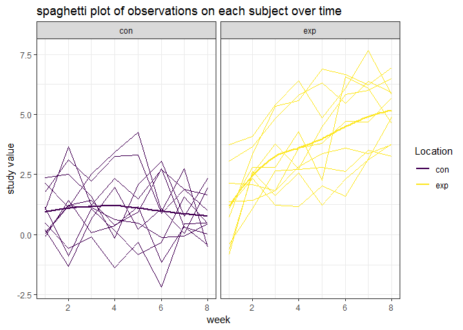
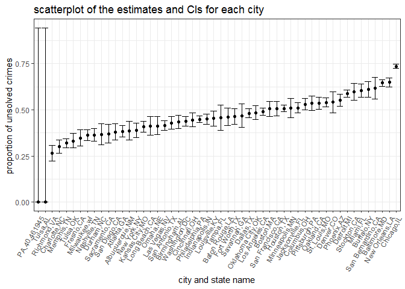

p8105\_hw5
================
Chu YU
2018-11-4

Problem 1
=========

### Data Cleaning

``` r
## import data and clean data
sdy_df = 
    tibble(file_name = list.files(path = "./data/")) %>% 
    mutate(subject_df = map(str_c("./data/", file_name), ~read_csv(.x))) %>% 
    unnest() %>%
    separate(file_name, into = c("group", "id"), sep = "_") %>% 
    gather(key = week, value = value, week_1:week_8) %>% 
    mutate(id = factor(str_replace(id, ".csv", "")),
        week = as.numeric(str_replace(week, "week_", "")))

str(sdy_df)
```

    ## Classes 'tbl_df', 'tbl' and 'data.frame':    160 obs. of  4 variables:
    ##  $ group: chr  "con" "con" "con" "con" ...
    ##  $ id   : Factor w/ 10 levels "01","02","03",..: 1 2 3 4 5 6 7 8 9 10 ...
    ##  $ week : num  1 1 1 1 1 1 1 1 1 1 ...
    ##  $ value: num  0.2 1.13 1.77 1.04 0.47 2.37 0.03 -0.08 0.08 2.14 ...

**(1) The importing and cleaning of data**

-   By using the function `list.files` and `map` in the problem 1 and using the name of the files'names as two new variables, I get a tidy dataframe which is a combination of the several csv files.

-   From the dataset, we can see there are four different variables and 160 variables.

    -   "group" (character) is the classification of the study.

    -   "id" (factor) is the subject id of the study result.

    -   "week" (number) means the time of observation of the study result.

    -   "value" (number) means the value of the study.

### Making plots about the study

``` r
##spaghetti plot 
sdy_df %>%
  ggplot(aes(x = week, y = value, color = group)) +
  geom_line(aes(group = id)) +
  geom_smooth(se = F) +
  facet_grid(.~ group) +
  labs(
    title = "spaghetti plot of observations on each subject over time",
    x = "week",
    y = "study value"
  ) 
```



**(2) The spaghetti plot showing observations on each subject over time**

-   the spaghetti plot has week as x and study value as y,

-   By dividing the plot of all the study values into two groups -- "control" and "experiment", we can clearly see the different tendency of different groups.

    -   for control group, the study value fluctuates little by the week. The line plot is stable and maybe have a decreasing tendency.

    -   for experiment group, the study value increases gradually as week increase.

    -   By comparing the two panels, we can see that the study value of experiment group is generally higher than the control value.

Problem 2
=========

The data of homicieds in 50 states in the US is gathered here.

### Import data

``` r
## import the data
homicide_df = read.csv("./homicide-data.csv") 

## new variable
homicide_num = homicide_df %>%
  mutate(city_state = str_c(city,",", state)) %>%
  group_by(city_state) %>%
  summarise(total_num = n(),
            unsolved_num = sum(disposition %in% c("Closed without arrest", "Open/No arrest")))
```

**(1) The dataframe**

-   The imported dataset has 12 variables and 52179 observations.

-   After importing the dataset of homicides, I firstly used `mutate` to add a new variable representing the city and state of the data. Then I computed the total number of homicides and number of unsolved homicided. Finally I got a dataset with 3 variables and 52 obs.

### For the city of Baltimore, MD

``` r
## filer the baltimore MD
bd_df = homicide_num %>%
  filter(city_state == "Baltimore,MD")

## prop.test
bd_prop = prop.test(bd_df$unsolved_num, bd_df$total_num)

## tidy
broom::tidy(bd_prop) %>%
  select(estimate, conf.low, conf.high) %>%
  knitr::kable(caption = "stats table of Baltimore MD", digits = 4)
```

|  estimate|  conf.low|  conf.high|
|---------:|---------:|----------:|
|    0.6456|    0.6276|     0.6632|

**(2) The proportion stats for Baltimore, MD**

-   By using `prop.test` function, we can get the one-sample proportions test with continuity correction results, from that we can know that :

    X-squared = 239.01, df = 1, p-value &lt; 2.2e-16, alternative hypothesis: true p is not equal to 0.5, 95 percent confidence interval: (0.6275625, 0.6631599) sample estimates:p = 0.6455607

-   By using `broom::tidy`, I get a table of the three vaiables of the dataset:

    "estimation", "conf.low" and "conf.high". By limiting the digits to 4, I knew that estimate proportion of the dataset is 0.6456, the 95% confidence interval of it is (0.6276, 0.6632)

### For each of the cities in dataset

``` r
homicide_prop = homicide_num %>%
  mutate(prop 
         = map2(.x = unsolved_num, .y = total_num, ~broom::tidy(prop.test(.x,.y)))) %>%
  unnest() %>%
  select(city_state,estimate, conf.low, conf.high) 
```

**(3) The proportion stats for each city **

-   Via `map2` I built a dataframe with 4 variables and 52 obs. I can see estimated proporions and confidence intervals of each city from the dataset.

### Creating a plot

``` r
homicide_prop %>%
  ggplot(aes(y = estimate,x = reorder(city_state, estimate))) + 
  geom_point() +
  geom_errorbar(aes(x = city_state, ymin = conf.low, ymax = conf.high)) +
  labs(
    title = "scatterplot of the estimates and CIs for each city",
    x = "city and state name",
    y = "proportion of unsolved crimes "
  ) +
   theme(axis.text.x = element_text(angle = 60, hjust = 1))
```



**(4) A plot that shows the estimates and CIs for each city**

-   By reordering the city name by its proportion of unsolved crimes, I finally got a scatterplot with errorbars.

    -   From the plot, I found that only PA and Tulsa in AL has zero proportion of unsolved crimes. Their unsolved crimes proportions are the lowerst of all the cities in the dataset.

    -   Chicago has the highest proportion of unsolved crimes, almost to 0.75. Though it is a large city, there may be more crimes happening, the proportion is still really disappointing.

    -   Among all the cities in the dataset, Tulsa and PA have the largest 95% confidence interval, which means there may be higher unsolved crimes proportion. Tampa also has very large 95% confidence interval compared to other cities.

    -   Chicago tends to have the smallest 95% CI among the cities.
